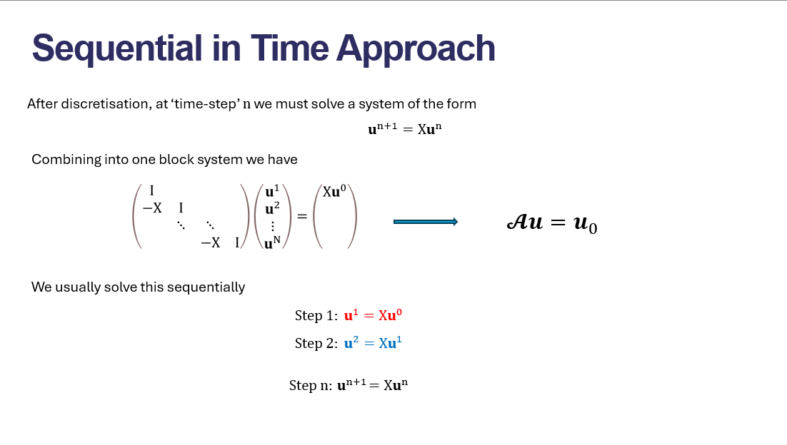
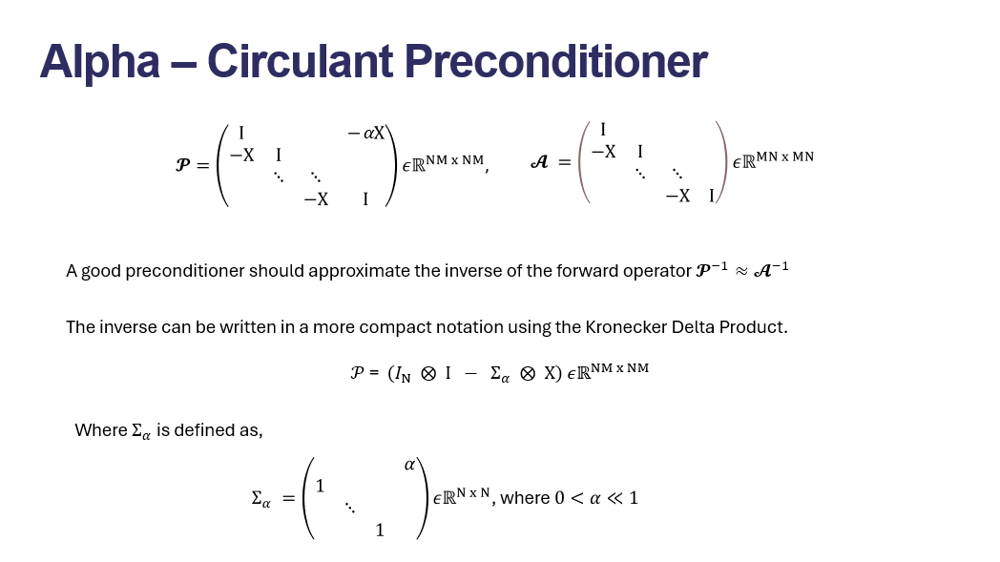
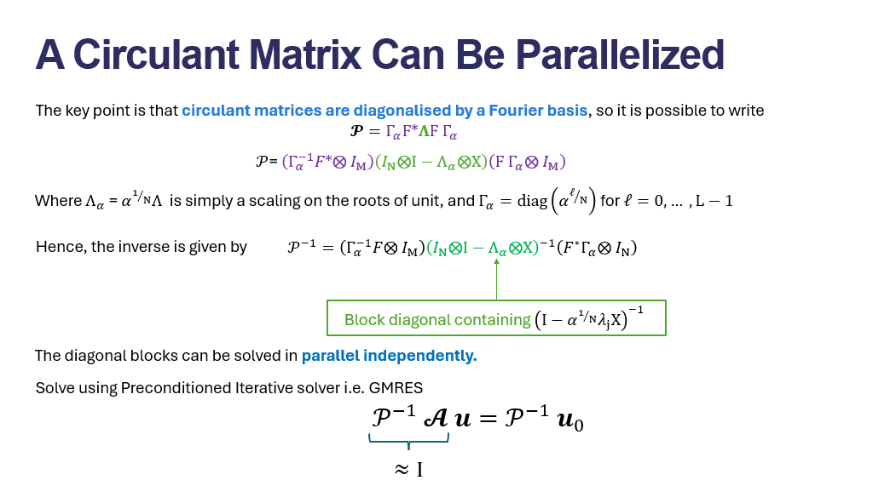

# Heun in Time Centered In Space

### Discretization method


$$
\hat{u}_k - u_k^n + \frac{c}{2}\left(u_{k+1}^n - u_{k-1}^n\right) = 0
$$

$$
u_k^{n+1} - u_k^n + \frac{c}{4}\left(u_{k+1}^n - u_{k-1}^n + \hat{u}_{k+1} - \hat{u}_{k-1}\right) = 0
$$


## Stability


## Backward Error Analysis


## Theoretical Performance
Perforamnce at some level is very dependent on the implementation.

Our current implementation is CPU.

Psuedo code

```python

for t in time_steps:
    u_hat = udpate_u(...)
    u_next = full_step_solve(...)


`full_step_solve` `O(k)` where k is the size of the space discretization

The full implementation is `O(n * k)` where n is the size of the time discretization

Arithmetic Intensity is a measure of FLOPs/ MemoryMovement.

The CPU implementation then yields an Arithmetic Intensity ~ ` O(n * k) / a`

Where `a` is a function of the amount of data being moved out of and into the computing chip.

For CPU implementation, this is ` size of L_1 cache / O(k)`

On GPU this would be the `size of GPU buffer / O(k)`

```


## Parallel in time



